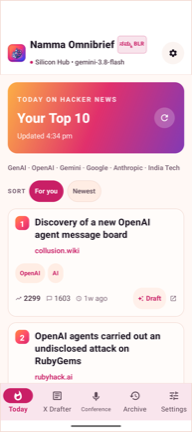
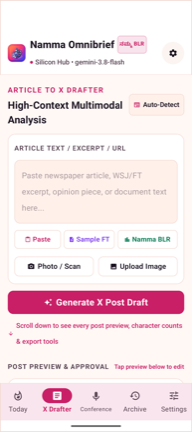
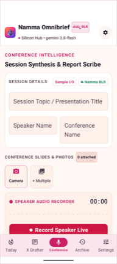
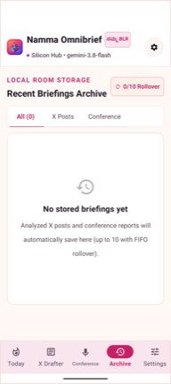
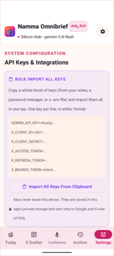
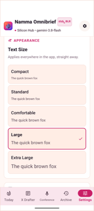

# Namma Omnibrief

A personal Android app for turning what you read and what you attend into publishable output.

Point your camera at a newspaper article, a magazine spread, or a screenshot and Gemini drafts a
ready-to-post summary for X — grounded strictly in what is actually in the image, with the correct
source attribution. Or record a conference session and get a structured field report you can mail to
yourself in seconds.

Built with Jetpack Compose, a single-Activity architecture, and a light, high-contrast UI with a
Bengaluru identity.

> Working on this codebase (human or AI)? Read [AGENTS.md](AGENTS.md) first — it documents the build
> prerequisites, the secrets policy and several non-obvious constraints.

---

## Contents

**New here?** Read [Getting started with Android Studio](#getting-started-with-android-studio), then
[Adding your keys](#adding-your-keys). That is everything you need to run the app.

- [Features](#features)
- [Screenshots](#screenshots)
- [Built with Google Antigravity](#built-with-google-antigravity)
- [Getting started with Android Studio](#getting-started-with-android-studio)
- [Building from the command line](#building-from-the-command-line)
- [Adding your keys](#adding-your-keys)
- [Posting to X: which credentials do you need?](#posting-to-x-which-credentials-do-you-need)
- [Model selection](#model-selection)
- [Architecture](#architecture)
- [Testing](#testing)
- [Deploying](#deploying)
- [Troubleshooting](#troubleshooting)
- [Privacy](#privacy)

---

## Features

### 1. Today — your Hacker News top 10

The screen the app opens on. It pulls live stories from Hacker News and ranks them against a fixed
set of interests — **GenAI, OpenAI, Gemini, Google, Anthropic, India tech** — rather than by raw
popularity, so a 2000-point story about an unrelated topic will not push out a relevant one.

- **No key required.** It uses the public, keyless [Algolia Hacker News Search
  API](https://hn.algolia.com/api), so the home screen is populated the very first time you launch
  the app, before you have configured anything.
- **Ranking**: `points + 600 × (interest matches) + 250 if currently on the HN front page`. A
  diversity cap of 3 stories per interest stops a single big news day filling the whole list.
- **Stays current on its own**: refreshes **every hour** while the app is running, and again
  **whenever you reopen the app** if the feed is more than 15 minutes old. The header shows the last
  fetch time, and the refresh button forces one at any time.
- **Each story shows its age** — "42m ago", "6h ago", "2d ago" — taken from the story's actual
  Hacker News post time, not from when the app fetched it. The labels tick over on their own.
- **Sort by relevance or by date**: the **For you / Newest** toggle under the header switches
  between the interest ranking above and strict newest-first. Both show the same ten stories, so
  nothing is hidden either way, and your choice is remembered between launches.
- **Loading state**: shimmering placeholder cards while the fetch is in flight.
- **Tap a card** to open the article, or tap **Draft** to pipe that headline straight into the
  Article → X flow.

### 2. Article → X

- **Capture or import**: take a photo, pick from the gallery, or paste raw text.
- **Batch of up to 10 images**: queue several photos at once. Each image is analysed independently
  and produces **its own post draft** — a newspaper page with three articles you photographed
  separately becomes three separate posts, not one blended mush.
- **Focused analysis**: the prompt instructs the model to lock on to the single dominant story in
  the frame and ignore peripheral columns, adjacent headlines, sidebars and advertisements that
  crept in at the edge of the shot. Every draft reports the `Main topic analysed` so you can verify
  it picked the right story.
- **Strictly grounded**: no editorialising, no outside knowledge, no invented figures or quotes, no
  emojis. If a fact is not in the image, it does not appear in the post.
- **Source attribution**: the masthead is detected from the image (WSJ, FT, NYT, The Hindu, Times of
  India, Economic Times, Deccan Herald, ...) and credited in the post.
- **Review then publish**: nothing is posted automatically. Review and edit every draft in the
  queue, remove the ones you don't want, then **Approve & Post All** publishes them one by one with
  spacing between calls, showing per-draft status.
- **The photo goes with the post**: each draft carries its own source image, and that image is
  uploaded and attached to its tweet. Needs the `media.write` scope — see
  [Attaching the photo](#attaching-the-photo-you-need-the-mediawrite-scope). Can be turned off in
  Settings.
- **Start fresh**: one control clears the attached photos, the pasted text and the whole draft
  queue, so the next article starts from a clean page instead of inheriting the last one's images.
- **X Blue long-form** supported via a toggle in Settings.

### 3. Conference Reporter

Capture slides, record audio notes and session metadata, then synthesize a structured report:
executive summary, key takeaways, slide insights, notable quotes and action items.

### 4. History, Email and Drive

- The last **10** briefs are stored locally (Room, FIFO rollover). Nothing is uploaded to a server.
- Any brief can be emailed to yourself via Gmail or saved to Google Drive as Markdown, using
  standard Android share intents.

### 5. Adjustable text size

**Settings → Appearance → Text Size** scales every piece of type in the app — five steps from
Compact to Extra Large. Each option renders its own preview at its own scale, so you can see the
result before you commit to it. The default is **Comfortable (1.15×)**, deliberately larger than
stock Material. The change applies immediately, with no restart.

The one exception is the bottom navigation bar: five tabs share the width, so its labels grow with
the setting only as far as they still fit on one line. Past that they hold their size rather than
wrapping "Conference" onto a second line and pushing the bar up over the content.

---

## Screenshots

Captured on a Pixel 10 (1080 × 2424, Android 17) running the debug build, at the default
**Comfortable (1.15×)** text size.

| Today | X Drafter | Conference |
|---|---|---|
|  |  |  |
| Your top 10, interest-ranked, with **For you / Newest** sorting and a story age on every card. | Photograph or paste an article, then review the draft before anything is published. | Slides, live audio and session metadata in one capture. |

| Archive | Settings | Text Size |
|---|---|---|
|  |  |  |
| The last 10 briefs, stored locally in Room with FIFO rollover. | Keys, model, and behaviour toggles — all on-device. | Five steps, each previewing itself at its own scale. |

---

## Built with Google Antigravity

This app was written with **[Google Antigravity](https://antigravity.google/)** — Google's agent-first
development platform. Effectively all of the Kotlin, the Gradle configuration, the tests and this
README were produced by an agent working inside Antigravity, driven by plain-English instructions and
reviewed turn by turn.

That includes the parts that are not code: photographing an article and watching the draft come back,
pushing OAuth tokens onto the phone over `adb`, taking the screenshots above, and running the live
end-to-end post to X.

### What the platform does

| Capability | What it meant here |
|---|---|
| **Agent-first, not autocomplete** | You describe an outcome — "add multiple images, cap at 10, post them one by one" — and the agent plans it, edits across files, builds and reports back. |
| **Editor + terminal + browser in one loop** | The same agent edits Kotlin, runs `./gradlew`, drives `adb` against a real Pixel, and opens a browser for the X OAuth consent screen. |
| **Artifacts instead of raw logs** | Task lists, plans and verification walkthroughs are written out as documents you can read and correct, rather than a scrolling transcript. |
| **Subagents in parallel** | Independent work — research, review, a second opinion on a design — can be farmed out and collected. |
| **Project rules it actually reads** | [AGENTS.md](AGENTS.md) is loaded automatically, so the build quirks and the secrets policy are honoured without restating them each session. |
| **Powered by Gemini 3** | The same family of models the app itself calls for drafting. |
| **Familiar shell** | A VS Code–style editor, so keybindings, the terminal and the file tree behave the way you expect. |

> [!NOTE]
> Free to download for macOS, Windows and Linux at
> [antigravity.google](https://antigravity.google/). Usage limits and model availability change —
> check the site for what is current.

### Using it instead of Android Studio

You can develop this app entirely in Antigravity and never open Studio. Everything the project needs
is command-line reachable:

```bash
export JAVA_HOME="/Applications/Android Studio.app/Contents/jbr/Contents/Home"

./gradlew :app:assembleDebug        # build
./gradlew :app:testDebugUnitTest    # 42 unit tests
adb install -r app/build/outputs/apk/debug/app-debug.apk
adb shell am start -n com.aistudio.omnibrief.kypzmr/com.example.MainActivity
```

See [Building from the command line](#building-from-the-command-line) for the full detail.

**What you still need from Android Studio:** the **Android SDK** and a **JDK**. The `JAVA_HOME` above
points into Studio's bundled JDK precisely because that is the easiest way to get one. If you would
rather not install Studio at all, install the
[command-line tools](https://developer.android.com/studio#command-line-tools-only) plus any JDK 17+
and point `local.properties` at that SDK instead.

**What Studio still does better**, and why this README keeps its Studio walkthrough:

- Device mirroring, the AVD manager and Logcat's filtering UI.
- The Layout Inspector and Compose previews.
- Profilers, APK Analyzer and the Play signing/upload wizards.

A practical split: let the agent write, build and test in Antigravity; open Studio when you need to
*look* at something — a running layout, a memory trace, a device screen.

---

## Getting started with Android Studio

New to Android Studio? This section assumes no prior experience. If you already know the IDE, the
short version is: open the folder, let Gradle sync, press Run.

### Step 1 — Install Android Studio

Download it from [developer.android.com/studio](https://developer.android.com/studio) and run the
setup wizard, accepting the defaults. The wizard installs the Android SDK for you.

You do **not** need to install Java separately. Android Studio bundles its own JDK (this project was
built with the JDK 25 that ships inside Studio 2026.1). Java is only something you have to think
about if you build from the terminal — see [Building from the command line](#building-from-the-command-line).

### Step 2 — Open the project

1. Start Android Studio.
2. Choose **Open** (not *New Project*), and select the `namma-omnibrief` folder — the one containing
   `settings.gradle.kts`. Pick the folder itself, not a file inside it.
3. If you are asked whether you trust the project, choose **Trust Project**.

Android Studio now runs a **Gradle sync**: it reads the build files and downloads every dependency.
Watch the status bar at the bottom. The first sync downloads a few hundred MB and can take several
minutes. Wait for **"Gradle sync finished"** before doing anything else.

> [!NOTE]
> Studio may offer to upgrade the Android Gradle Plugin. That is safe to accept, but **verify it
> before you keep it** — run `./gradlew :app:assembleDebug :app:testDebugUnitTest` and check both
> pass. An unattended AGP upgrade is a common way to break a working build, so treat a green test
> run as the condition for keeping it. If Studio instead says your version is too *old* to open the
> project, update Android Studio itself.

### Step 3 — Pick something to run the app on

You need either an emulator or a real phone. A real phone is better here, because this app uses the
camera and microphone.

#### Option A — Create an emulator

A fresh SDK install has no virtual devices, so you create one:

1. **View → Tool Windows → Device Manager** (or the phone icon in the right sidebar).
2. Click **＋ → Create Virtual Device**.
3. Pick any modern phone, for example **Pixel 8**, then **Next**.
4. Choose a system image. Any API level **24 or higher** works; **API 36** matches what this project
   targets. If there is a **Download** link next to the image name, click it first and wait.
5. **Next → Finish**, then press ▶ in Device Manager to boot it.

> [!TIP]
> The emulator can fake a camera, but photographing a newspaper is the whole point of this app. Use a
> real phone if you have one.

#### Option B — Use your own Android phone

Do this once, whichever connection method you pick:

1. On the phone: **Settings → About phone**, then tap **Build number** seven times. You will see
   "You are now a developer".
2. Go to **Settings → System → Developer options**.

Now choose wired or wireless. Wired is simpler to get working the first time; wireless is nicer
day to day, especially for this app, because you can pick the phone up and photograph a newspaper
without a cable pulling at it.

##### Wired (USB)

1. In **Developer options**, turn on **USB debugging**.
2. Connect the phone to the Mac with a USB cable.
3. On the phone, a dialog asks **"Allow USB debugging?"** — tick *Always allow from this computer*
   and accept.

> [!IMPORTANT]
> That dialog is the single most common reason a phone never appears. It can be easy to miss, and it
> does not reappear on its own. If the phone does not show up, unplug and replug to trigger it again.
> Also make sure the cable is a **data** cable — many charge-only cables look identical and will
> charge the phone while never enumerating it to the Mac.

##### Wireless (Wi-Fi)

The phone and the Mac must be on the **same network**. Note that many corporate and guest Wi-Fi
networks block devices from talking to each other, which stops this working; a home network or a
phone hotspot is a reliable fallback.

1. In **Developer options**, turn on **Wireless debugging**.
2. In Android Studio: **Device Manager → ＋ → Pair using Wi-Fi**. A QR code appears.
3. On the phone: **Wireless debugging → Pair device with QR code**, and scan it.

Or pair entirely from the terminal, which is useful when the QR flow is being uncooperative. Tap
**Pair device with pairing code** on the phone to get a code and a `host:port`:

```bash
adb pair 192.168.1.50:41234     # the port shown on the PAIRING screen
adb connect 192.168.1.50:5555   # the port shown on the main Wireless debugging screen
```

> [!WARNING]
> Pairing and connecting use **two different ports**, and mixing them up is the usual failure. The
> pairing port is shown only on the "Pair device with pairing code" dialog and is single-use. The
> connect port is on the main Wireless debugging screen and changes whenever Wi-Fi reconnects.

Pairing is remembered, so after the first time you only need `adb connect`. If the phone drops off
after a reboot or a network change, reconnect with the current port — you do not have to pair again.

##### Check the Mac can see the phone

```bash
adb devices -l
```

A wirelessly connected device looks like this — the `_adb-tls-connect._tcp` suffix is how you know
it is on Wi-Fi rather than USB:

```
List of devices attached
adb-57301FDCR003L3-wccOcB._adb-tls-connect._tcp device product:frankel model:Pixel_10
```

| What you see | What it means |
|---|---|
| `device` | Working. You are done |
| `unauthorized` | You have not accepted the "Allow USB debugging?" dialog on the phone |
| `offline` | Connection went stale. `adb disconnect` then `adb connect <ip>:<port>` |
| Nothing at all | Wrong cable, wrong network, or wireless debugging got switched off |

If `adb` is not on your `PATH`, either use the full path
`~/Library/Android/sdk/platform-tools/adb` or add it once:

```bash
echo 'export PATH="$PATH:$HOME/Library/Android/sdk/platform-tools"' >> ~/.zshrc && source ~/.zshrc
```

When things get truly stuck, restarting the bridge clears most of it:

```bash
adb kill-server && adb start-server && adb devices -l
```

### Step 4 — Run it

1. In the toolbar at the top, the dropdown on the left should read **app**. Next to it, choose your
   emulator or phone.
2. Press the green **▶ Run** button (or `Ctrl+R` on macOS).

The first build takes a few minutes; later ones are much faster. The app installs and launches
automatically.

**Useful panels while it runs:**

| Panel | What it is for |
|---|---|
| **Run** (bottom) | Build progress and install errors |
| **Logcat** (bottom) | Live log from the device. Filter by `package:mine` to see only this app |
| **Build** (bottom) | Compile errors — click one to jump to the line |
| **Problems** | Warnings and lint findings |

If the app misbehaves, Logcat is where the answer is. The networking code logs under the tags
`GeminiApi` and `XApiService`.

### Step 5 — Mirror the phone on your Mac (optional, but worth it)

Mirroring puts the phone's screen in a window on the Mac, so you can drive the app with your mouse
and keyboard instead of constantly reaching for the handset. Typing a long API key into the Settings
screen is dramatically less painful this way.

#### Android Studio's built-in mirroring (nothing to install)

This is the one to start with. It ships with Studio and works over both USB and Wi-Fi.

1. Connect the phone (either method above).
2. **View → Tool Windows → Running Devices**.
3. Pick your device from the tab strip. The screen appears in the panel.

You can click, scroll, type with the Mac keyboard, and paste into the phone. The toolbar has buttons
for rotate, volume, Back/Home/Overview, and a screenshot. If the panel is cramped, drag it out into
its own window with **⚙ → View Mode → Float**.

> [!NOTE]
> Mirroring is on by default. If the panel says nothing is available, check
> **Settings → Tools → Device Mirroring** and confirm *Activate mirroring when a device is connected*
> is ticked. Over Wi-Fi it is slightly laggier than USB, which is normal.

> [!IMPORTANT]
> Mirroring cannot unlock the phone for you. If the screen is locked, the mirror shows the lock
> screen and any screenshot comes out black. Unlock the handset first.

#### scrcpy (optional, smoother)

[scrcpy](https://github.com/Genymobile/scrcpy) is a free, open-source mirror that is noticeably
faster and more responsive than the built-in panel, and it runs without Studio open at all. It needs
Homebrew, which is not installed on this machine:

```bash
# one-time: install Homebrew, then scrcpy
/bin/bash -c "$(curl -fsSL https://raw.githubusercontent.com/Homebrew/install/HEAD/install.sh)"
brew install scrcpy

scrcpy                    # mirror
scrcpy --turn-screen-off  # mirror while the phone's own screen stays dark, saving battery
scrcpy --record demo.mp4  # mirror and record to a file
```

It is strictly a convenience. The built-in panel is enough to test this app.

#### Capturing without mirroring

For a quick screenshot or a screen recording — handy for bug reports — you do not need a mirror at
all:

```bash
adb exec-out screencap -p > screen.png      # screenshot straight to the Mac
adb shell screenrecord /sdcard/demo.mp4     # record; Ctrl+C to stop
adb pull /sdcard/demo.mp4                   # then copy it over
```

### Step 6 — Add your keys

The app builds and launches with no keys at all, but it cannot call Gemini or X until you add them.
Open **Settings** in the running app and paste them in — see [Adding your keys](#adding-your-keys)
below.

---

## Building from the command line

Optional — everything above can be done from the IDE. But if you want to script it:

Gradle needs to know where Java is, and the JDK inside Android Studio is not on your `PATH` by
default. Without this you get `Unable to locate a Java Runtime`:

```bash
export JAVA_HOME="/Applications/Android Studio.app/Contents/jbr/Contents/Home"
```

| Command | What it does |
|---|---|
| `./gradlew :app:assembleDebug` | Build a debug APK |
| `./gradlew :app:installDebug` | Build and install onto the connected device |
| `./gradlew :app:testDebugUnitTest` | Run the unit tests |
| `./gradlew :app:lint` | Static analysis |
| `./gradlew clean` | Delete build outputs |

The APK lands in `app/build/outputs/apk/debug/app-debug.apk` (~23 MB).

---

## Adding your keys

There are two ways to supply credentials. **No key is ever committed to this repository.**

### Option A — in the app (recommended)

Open **Settings** in the app and paste your keys. Every field has a **Paste** button that reads
straight from the clipboard, so you never have to type a token by hand.

If you keep all your keys together (in a password manager note, or a `.env` file), copy the whole
block and use **Import All Keys From Clipboard** — it parses the lot in one tap. Both `=` and `:`
separators work, and `export ` prefixes, quotes, trailing commas and `#` comments are tolerated:

```
GEMINI_API_KEY=AIzaSy...
X_CLIENT_ID=cXo1...
X_CLIENT_SECRET=...
X_ACCESS_TOKEN=...
X_REFRESH_TOKEN=...
X_BEARER_TOKEN=AAAA...
```

Keys entered this way are stored in the app's private `SharedPreferences` on the device only, and
are sent solely to Google and X over HTTPS.

### Option B — a local `.env` for development (cannot enable posting)

> [!IMPORTANT]
> A `.env` can supply **only** the Gemini key and the app-only X **Bearer** token. Neither of those
> can publish a post. The app-only bearer is rejected by X with
> `403 Unsupported Authentication` on `POST /2/tweets`, and the four OAuth 2.0 fields have **no**
> build-time fallback — they are read from Settings only. **If you want to post to X, you must use
> Option A.**

Create a `.env` in the project root (it is git-ignored; see `.env.example`):

```
GEMINI_API_KEY=your_key_here
X_BEARER_TOKEN=your_token_here      # read-only endpoints; CANNOT post
```

These two are injected into `BuildConfig` at build time by the Secrets Gradle plugin. Use this route
when you just want article analysis working on a dev build without tapping through Settings.

What each route can configure:

| Credential | Settings (Option A) | `.env` (Option B) | Needed to post? |
|---|---|---|---|
| `GEMINI_API_KEY` | Yes | Yes | No (needed to analyse) |
| `X_BEARER_TOKEN` | Yes | Yes | **No — cannot post** |
| `X_CLIENT_ID` | Yes | **No** | **Yes** |
| `X_CLIENT_SECRET` | Yes | **No** | **Yes** |
| `X_ACCESS_TOKEN` | Yes | **No** | **Yes** |
| `X_REFRESH_TOKEN` | Yes | **No** | Yes (to auto-renew) |

Resolution order at runtime is: **Settings value → `BuildConfig` (`.env`) → empty**.

---

## Posting to X: which credentials do you need?

This matters, because the two token types are not interchangeable:

| Credential | Can read | Can post | Use it for |
|---|---|---|---|
| **App-only Bearer token** | Yes | **No** — `POST /2/tweets` returns `403 Unsupported Authentication` | Read-only endpoints |
| **OAuth 2.0 User Context** (`tweet.write` scope) | Yes | **Yes** | Actually publishing posts |
| …the same token **without `media.write`** | Yes | Text only — the photo upload returns `403` | See below |

So to post from inside the app you must use **OAuth 2.0 User Context**. In Settings, select the
OAuth 2.0 protocol and fill in Client ID, Client Secret, Access Token and Refresh Token, then tap
**Test Connection & Refresh Token** to verify and mint a fresh access token. The app refreshes the
token automatically — both before a post when the stored token is close to expiring, and again if a
post attempt returns `401`.

> **Note:** refreshing rotates your refresh token. The new value is saved back into Settings
> automatically — if you also keep the token elsewhere, update your copy.

If you'd rather not wire up OAuth at all, every draft has an **Open in X app** action that hands the
composed text to the official X composer, where you tap Post yourself.

### Do you have to keep renewing the tokens?

**No — not routinely.** Once OAuth 2.0 is set up, the app maintains itself:

| Credential | Lifetime | Who renews it |
|---|---|---|
| Access token | 2 hours | The app, automatically — 5 minutes before expiry, and again if a post returns `401` |
| Refresh token | ~6 months, and **rotates every time it is used** | The app saves the new value back into Settings |
| Client ID / Client Secret | Until you regenerate them in the Developer Portal | You, and only if you regenerate them |

You only need to re-authorise (§*Re-authorising with `media.write`*) if:

- the app goes unused for roughly six months, so the refresh token lapses;
- you used the same refresh token somewhere else — rotation invalidates the copy the app holds;
- you regenerated the Client Secret in the Developer Portal; or
- you revoked the app under **X → Settings → Security and account access → Apps and sessions**.

If a post ever fails with a token error, the quickest check is Settings →
**Test Connection & Refresh Token**.

### Attaching the photo: you need the `media.write` scope

The app uploads the photographed article and attaches it to the post. **This needs a scope that
`tweet.write` does not include.** Authorise with all five:

```
tweet.read  tweet.write  users.read  offline.access  media.write
```

**Symptom if it is missing:** posting text works fine, but attaching a photo fails with a bare
`403 Forbidden` that says nothing about scopes. The app recognises this case and tells you so.

**Workaround in the meantime:** Settings → turn off **Attach photo to post**. Posts then go out as
text only, which is how the app behaved before attachments existed.

> [!NOTE]
> Verified end to end on 14 September 2026: a photographed article was drafted, approved and
> published from the app, and the resulting post carried the image at 1600 px — the same cap the
> app applies before upload.

#### Re-authorising with `media.write`

> [!IMPORTANT]
> **The Developer Portal cannot grant this scope.** Its *Generate OAuth 2.0 Access Token* dialog
> shows a fixed checkbox list — `tweet.*`, `users.read`, `dm.*`, `like.*`, `follows.*`, `list.*` and
> so on — and `media.write` is simply not on it. No amount of regenerating tokens there will help.
> The scope exists and works; it is only reachable through the authorization URL, which is what the
> helper script sends.

**1. Check the App settings.** [developer.x.com](https://developer.x.com/) → your Project → your App
→ **User authentication settings**:

| Field | Value |
|---|---|
| App permissions | **Read and write** (or *Read and write and Direct message*) |
| Type of App | **Web App, Automated App or Bot** — confidential client |
| Callback URI / Redirect URL | note down whatever is registered; you will pass it to the script |

You do **not** need to add a new callback. Use the one that is already there — the script can work
with any registered URL. Only add `http://127.0.0.1:8765/callback` if you want the fully automatic
mode, and be aware X may refuse a plain-`http` callback on a confidential client.

Copy the **Client ID** and **Client Secret** from *Keys and tokens*.

**2. Run the helper**, pointing it at your registered callback:

```bash
# using a callback you already have registered
python3 tools/x_oauth_setup.py --redirect-uri https://github.com/your-username

# or, if you registered the loopback, just:
python3 tools/x_oauth_setup.py
```

It prompts for the Client ID and Client Secret (hidden, never an argument), builds a PKCE `S256`
challenge and opens the consent screen.

**3. Confirm the scope on the consent screen.** Before approving, read the permission list. You are
looking for:

> ✎ **Upload media like photos and videos for you.**

That line *is* `media.write`. If it isn't there, stop — nothing downstream will fix it.

Tick **I trust this app** (X greys out the Authorize button until you do; it appears because your
callback domain isn't one X can verify), then **Authorize app**.

**4. Hand the code back.** With the loopback callback the script catches it itself. With a hosted
callback your browser lands on that page with `?code=…` in the address bar — copy the **entire URL**
and paste it at the prompt.

> [!CAUTION]
> Authorization codes expire in about **30 seconds**. Have the terminal ready before you click
> Authorize. If you get `Value passed for the authorization code was invalid`, the code just went
> stale — re-run the script. The second time through X usually skips the consent screen and
> redirects immediately, because you've already approved.

**5. Verify.** The script prints what the server actually granted:

```
Granted scopes: offline.access tweet.write media.write users.read tweet.read

media.write IS present. Photo uploads will work.
```

**6. Paste into the app.** Settings → *OAuth 2.0 User Context Keys* → **Access Token** and **Refresh
Token** → Save → tap **Test Connection & Refresh Token**.

The script writes nothing to disk. Clear your terminal scrollback afterwards. From here the app
renews the access token itself, rotating the refresh token on each renewal.

**Confirming it really worked**, if you want proof beyond the scope string — this uploads an image
without posting anything (unattached media expires after 24 hours):

```bash
curl -s -w "\nHTTP %{http_code}\n" -X POST "https://api.x.com/2/media/upload" \
  -H "Authorization: Bearer $ACCESS_TOKEN" \
  -F "media=@some-photo.jpg" -F "media_category=tweet_image"
```

`HTTP 200` with a `data.id` means the scope is live. `HTTP 403` with a bare
`{"title":"Forbidden","status":403}` means it is still missing.

### Getting the keys

- **Gemini API key**: [Google AI Studio](https://aistudio.google.com/apikey).
- **X keys**: [X Developer Portal](https://developer.x.com/) → your project → *Keys and tokens*.
  Enable OAuth 2.0, set the app permissions to **Read and write**, and request the
  `tweet.write` **and `media.write`** scopes.

---

## Model selection

Settings lets you pick the active Gemini model. The app is configured for
`gemini-3.8-flash` in high-context mode and automatically falls back down the chain
(`3.8 → 3.5 → 2.5 flash`) if a model is unavailable or rate-limited, so an analysis rarely fails
outright.

---

## Architecture

| Layer | Implementation |
|---|---|
| UI | Jetpack Compose, Material 3, single Activity, `when`-based destination switching |
| State | One `MainViewModel` exposing `StateFlow`s, collected with `collectAsStateWithLifecycle()` |
| Persistence | Room (`BriefItem`, 10-item FIFO rollover) + `SharedPreferences` for settings |
| Networking | OkHttp + `org.json`, no generated clients |
| Gemini | `generativelanguage.googleapis.com/v1beta`, images downscaled to 1600px and sent as base64 JPEG `inlineData` |
| Hacker News | `hn.algolia.com/api/v1` — public and keyless, so the Today tab works with nothing configured |
| X | `api.twitter.com/2/tweets`, with OAuth 2.0 refresh at `/2/oauth2/token` |
| Typography | `appTypography(scale)` multiplies every M3 text style, driven by a `fontScale` StateFlow |
| Export | Android share intents to Gmail and Drive via a `FileProvider` |

```
app/src/main/java/com/example/
├── MainActivity.kt              # Scaffold, top bar, bottom nav
├── data/
│   ├── local/                   # Room database, entity, DAO
│   ├── preferences/             # AppPreferences (keys, model, toggles, font scale)
│   ├── remote/                  # GeminiApiService, XApiService, HackerNewsService
│   └── repository/              # BriefRepository
└── ui/
    ├── components/              # OmniTopBar, OmniNavBar, XPostPreviewCard, PhotoStripView
    ├── screens/                 # Headlines, ArticleToX, ConferenceReporter, History, Settings
    ├── theme/                   # Light theme, colours, scalable typography
    └── viewmodel/               # MainViewModel
```


---

## Testing

### Automated tests

In Android Studio, right-click `app/src/test/java/com/example` in the Project panel and choose
**Run 'Tests in com.example'**. Results appear in the Run panel, green for pass.

From the terminal:

```bash
./gradlew :app:testDebugUnitTest
```

There are 8 tests. They run on your computer, not a device, so they take seconds and need no
emulator. They cover:

- the app name and preference round-tripping;
- the **no-hardcoded-secrets invariant** — every credential must resolve to empty until the user
  configures one;
- the bulk clipboard key parser;
- a Roborazzi screenshot snapshot of the top bar.

If the screenshot test fails after you intentionally change the top bar, re-record the baseline:

```bash
./gradlew recordRoborazziDebug
```

### Manual smoke test

The automated tests do not cover the UI flows, so after any significant change run through this by
hand on a device:

| # | Flow | Expected |
|---|---|---|
| 1 | Settings → paste Gemini key → Save | "All Settings saved successfully" |
| 2 | Article → X → camera → photograph an article → Analyse | A draft appears with "Main topic analysed: …" naming the right story |
| 3 | Add 2-3 photos at once | One separate draft **per image**, not one merged post |
| 4 | Try to add an 11th image | Blocked at the 10-image cap |
| 5 | Edit a draft, delete another | Queue updates; counts stay correct |
| 6 | Scroll to the bottom of **every** screen | Nothing hidden behind the bottom nav bar |
| 7 | Settings → Test Connection & Refresh Token | Clear success or a readable error |
| 8 | History | The batch appears as one entry; older entries roll off past 10 |

For step 2, check the draft against the photo before trusting it. The prompt is strict about
staying grounded, but verifying beats assuming.

> [!TIP]
> Watch **Logcat** while testing and filter by `package:mine`. API failures are logged under the
> `GeminiApi` and `XApiService` tags with the real error from the server.

### Instrumented tests

`./gradlew :app:connectedAndroidTest` runs on-device tests, but this project has only the default
placeholder, so there is nothing meaningful to run yet.

---

## Deploying

"Deploy" means different things depending on what you want. This is a personal app, so option 1 is
almost certainly what you want.

### Option 1 — Just put it on your own phone (recommended)

Pressing **▶ Run** in Android Studio already installs the app on the connected device, and it stays
there after you unplug it. That is the whole job.

To install on a phone that is not connected to your computer, build an APK and transfer it:

```bash
./gradlew :app:assembleDebug
# app/build/outputs/apk/debug/app-debug.apk
```

Send that file to the phone (Drive, email, AirDrop to a Mac then a cable) and tap it. Android will
ask you to allow installing from unknown sources — that is expected for an app that did not come
from the Play Store.

> [!NOTE]
> A debug APK is signed with an automatically generated debug key. That is fine for personal use.
> It cannot be uploaded to the Play Store, and if you later install a release build you must
> uninstall the debug one first, because the signatures differ.

### Option 2 — A signed release build

Only needed if you want a smaller, optimised build or intend to distribute it.

First create a keystore. **Keep this file and its passwords safe** — Android identifies your app by
its signature, so losing the keystore means you can never update an installed app:

```bash
keytool -genkey -v -keystore my-upload-key.jks \
  -keyalg RSA -keysize 2048 -validity 10000 -alias upload
```

The build picks it up through environment variables:

```bash
export KEYSTORE_PATH="$PWD/my-upload-key.jks"
export STORE_PASSWORD="…"
export KEY_PASSWORD="…"
./gradlew :app:assembleRelease      # APK
./gradlew :app:bundleRelease        # AAB, the format the Play Store wants
```

Outputs land in `app/build/outputs/`. `*.jks` files are git-ignored, so your keystore will not be
committed by accident.

> [!IMPORTANT]
> If no keystore is found the release build still succeeds, but **unsigned** — the build log warns
> you. An unsigned APK cannot be installed on a device.

### Option 3 — Google Play

Only worth it if you want to share the app beyond yourself. For a personal app, **Internal testing**
is almost certainly where you want to stop: it distributes to up to 100 email addresses, needs no
public listing, and skips the hardest requirement below.

#### Fix these two first — they are specific to this app

> [!CAUTION]
> **`applicationId` is permanent.** It is currently `com.aistudio.omnibrief.kypzmr`, a leftover from
> the original project scaffold. Once you upload a build under an ID you can never change it, and you
> cannot reuse it for a different app. Worse, `com.aistudio.*` reads as a claim of affiliation with
> Google's AI Studio, which is the kind of thing that draws an impersonation rejection. Change it to
> a domain you control — `com.cmanikandan.omnibrief` or similar — **before the first upload**. Edit
> `applicationId` in [app/build.gradle.kts](app/build.gradle.kts); the internal `namespace`
> (`com.example`) is a separate thing and does not need to change.

> [!IMPORTANT]
> **A reviewer cannot use this app.** It does nothing until you paste in a Gemini key and X
> credentials, so to a tester it looks broken. Fill in **App content → App access** in Play Console,
> explain that the user supplies their own keys, and say where (Settings). Apps that appear
> non-functional to a reviewer get rejected, and "they didn't add a key" is not something they will
> guess.

#### What Play requires

| Requirement | Status here |
|---|---|
| Developer account, one-off **25 USD** | Plus identity verification |
| **App bundle** (`.aab`), not an APK | `./gradlew :app:bundleRelease` |
| **Signed** release build | Not yet — currently builds **unsigned** unless `KEYSTORE_PATH` is set. See option 2 |
| Unique, permanent `applicationId` | **Must change** — see above |
| `versionCode` increments every upload | Currently `1`; bump for each new upload |
| **Target API level** within one year of the latest Android release | Targets **36**. The Pixel used for testing already runs Android 17 (API 37), so this deadline will move — check the [current requirement](https://developer.android.com/google/play/requirements/target-sdk) before you submit |
| **Privacy policy** at a public URL | **Must write one.** Not optional here: the app uses the camera and microphone and sends content to Google and X |
| **Data safety** form | Must declare photos, audio and that data goes to third parties |
| **Content rating** questionnaire | Straightforward for this app |
| **App access** instructions | Required — see the callout above |
| Store listing assets | 512×512 icon, 1024×500 feature graphic, ≥2 phone screenshots, 80-char short description, 4000-char full description |

#### The catch for personal accounts

If your developer account is **personal** (not a company) and was created after **13 November 2023**,
Play will not let you ship to production until you have run a **closed test with at least 12 testers
opted in continuously for 14 days**, and then applied for production access. Testers who drop out
reset the clock, and you have to summarise their feedback in the application.

**Internal testing is exempt from all of that** and is available immediately. For an app you built
for yourself, that is the sensible destination — you get Play delivery and automatic updates without
recruiting a dozen people.

#### Rough order of work

1. Change `applicationId`, bump `versionCode`.
2. Create an upload keystore and build a signed `.aab` (option 2 above).
3. Register at [Play Console](https://play.google.com/console), verify identity, pay the 25 USD.
4. Create the app, upload the bundle to **Internal testing**, add your own email as a tester.
5. Complete Data safety, Content rating, App access and the privacy policy URL.
6. Only if you want it public: run the 12-tester closed test, then apply for production.

---

## Troubleshooting

Problems this project has actually hit:

| Symptom | Cause and fix |
|---|---|
| `Unable to locate a Java Runtime` | Terminal builds only. `export JAVA_HOME="/Applications/Android Studio.app/Contents/jbr/Contents/Home"` |
| `SDK location not found` | Missing `local.properties`. Opening the project in Studio creates it, or add `sdk.dir=/Users/<you>/Library/Android/sdk` |
| `Keystore file ... debug.keystore not found` | Stale build config. Already fixed here — signing is applied only when a keystore exists. Re-sync Gradle |
| Build seems to hang with no output | Piping Gradle into `tail` buffers everything. Use `tee`, or no pipe |
| Device not listed in the Run dropdown | USB debugging off, or the "Allow USB debugging?" prompt was not accepted. Check `adb devices` |
| Phone was there, now shows `offline` | Wireless connection went stale. `adb disconnect && adb connect <ip>:<port>` with the **current** port from Wireless debugging |
| `adb pair` fails or says "connection refused" | Using the connect port instead of the pairing port. The pairing port only appears on the "Pair device with pairing code" dialog and is single-use |
| Phone vanishes from Wi-Fi after a reboot | Expected. The connect port changes; reconnect with the new one. You do not need to pair again |
| Wireless pairing never works at all | Some corporate and guest networks block device-to-device traffic. Try a home network or a phone hotspot |
| Screenshot or mirror is all black | The phone is locked or the display is asleep. Unlock the handset — mirroring cannot do it for you |
| `INSTALL_FAILED_UPDATE_INCOMPATIBLE` | A build with a different signature is installed. `adb uninstall com.aistudio.omnibrief.kypzmr` then install again |
| Gradle sync fails right after opening | Usually a transient download failure. **File → Sync Project with Gradle Files** and retry |
| `Configuration cache ... cannot be reused` | Informational, not an error. Editing build files invalidates the cache and the next build is slower |
| "unable to strip ... libandroidx.graphics.path.so" | Harmless warning, ignore |

---

## Privacy

This is a personal app. Briefs are stored only on the device, capped at the 10 most recent. Images
and text are sent to the Gemini API for analysis and, when you approve a post, to X. Nothing else
leaves the device.
